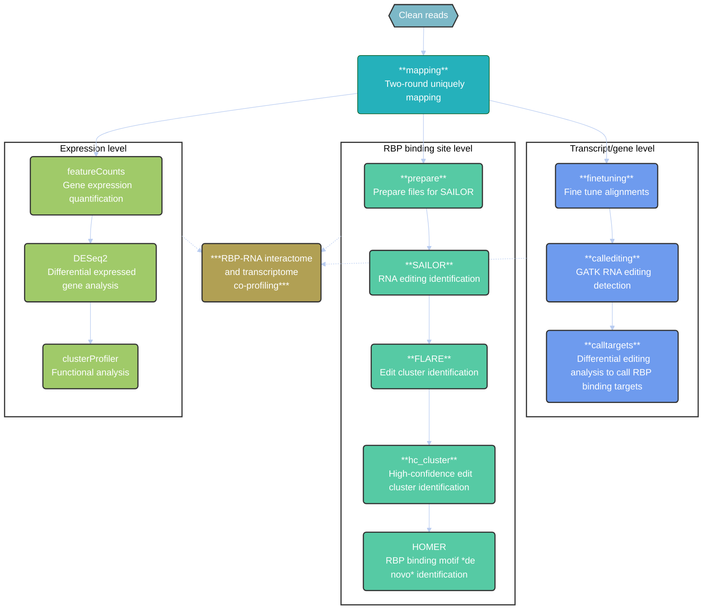

# MAPIT-seq Pipeline

Author: **Gang Xie**, PKU-THU-NIBS Joint Graduate Program, Academy for Advanced Interdisciplinary Studies, Peking University, Beijing, China

Email: **gangx1e@stu.pku.edu.cn**

Date: July 25, 2025

Version: 1.7

----

MAPIT-seq (**M**odification **A**dded to RNA-binding **P**rotein **I**nteracting **T**ranscript **Seq**uencing) is to identify RBP target transcripts based on adjacently editing by both hADAR2dd and rAPOBEC1. This pipeline is designed to identify RNA-editing events by hADAR2dd and rAPOBEC1 from MAPIT-seq data, and then find the find RBP binding regions with high confidence and *de novo* discover RBP binding motifs.

## Cite us

If you found this pipeline useful in your work, please cite our paper:
```
Cheng, Q.-X.#, Xie, G.#, Zhang, X., Wang, J., Ding, S., Wu, Y.-X., Shi, M., Duan, F.-F., Wan, Z.-L., Wei, J.-J., Xiao, J., Wang, Y. Co-profiling of transcriptome and in situ RNA-protein interactions in single cells and tissues. (2025, Accepted). https://doi.org/10.1038/s41592-025-02774-4
```

## Install

All softwares in our pipeline are available in [conda](https://docs.conda.io/en/latest/miniconda.html). We recommend you to install these softwares via conda:

```
git clone https://github.com/WangLabPKU/MAPIT-seq
cd MAPIT-seq
conda env create -f env_specific.yml # or use env.yml, more flexible but slower 
wget https://hgdownload.soe.ucsc.edu/admin/exe/linux.x86_64.v479/bedGraphToBigWig
chmod +x Mapit src/MAPIT-seq.sh bedGraphToBigWig
```

### Optional: Add `Mapit` to your conda environment PATH

```
conda activate Mapit-seq
mkdir -p $CONDA_PREFIX/etc/conda/activate.d
mkdir -p $CONDA_PREFIX/etc/conda/deactivate.d

cat <<EOF > $CONDA_PREFIX/etc/conda/activate.d/activate-mapit.sh
#!/usr/bin/env sh
export PATH="\$PATH:/home/gangx/apps/Mapit-seq"
EOF

cat <<EOF > $CONDA_PREFIX/etc/conda/deactivate.d/deactivate-mapit.sh
#!/usr/bin/env sh
export PATH=\$(echo "\$PATH" | tr ':' '\\n' | grep -v '^/home/gangx/apps/Mapit-seq\$' | paste -sd:)
EOF

chmod +x $CONDA_PREFIX/etc/conda/activate.d/activate-mapit.sh $CONDA_PREFIX/etc/conda/deactivate.d/deactivate-mapit.sh
```

## Install MAPIT dependencies 

### REDItools2
```
cd ..
git clone https://github.com/BioinfoUNIBA/REDItools2 
conda install mpi4py -c bioconda -c conda-forge
cd REDItools2
pip install -r requirements.txt
```

### FLARE
```
cd ..
git clone https://github.com/YeoLab/FLARE
conda install snakemake -c bioconda -c conda-forge
pip install deeptools
```


## Configuration

Prepare these files beforehand:

- Reference genome FASTA

- Annotation files (.gtf, .gff3)

- RepeatMasker annotation

- Known SNP datasets, split by chromosome (e.g. dbSNP, 1000 Genomes, EVS/EVA)

All configuration is stored in `conf/GenomeVersion.json`, e.g. `conf/GRCh38.json`.

### Download Reference Sequence and Annotation 

- Abundant RNA (rRNA, tRNA, mt-rRNA and mt-tRNA) sequence (provided in `ref` fold) and create the index by **BWA-MEM**.

- Reference genome downloaded from [Gencode](https://www.gencodegenes.org/) and [UCSC](https://genome.ucsc.edu/index.html)

Below is an example using the human genome (GRCh38):

```
cd "your_ref_path"
wget https://ftp.ebi.ac.uk/pub/databases/gencode/Gencode_human/release_40/GRCh38.p13.genome.fa.gz
wget https://ftp.ebi.ac.uk/pub/databases/gencode/Gencode_human/release_40/gencode.v40.chr_patch_hapl_scaff.annotation.gtf.gz
wget https://ftp.ebi.ac.uk/pub/databases/gencode/Gencode_human/release_40/gencode.v40.chr_patch_hapl_scaff.annotation.gff3.gz

# RepeatMasker
wget http://hgdownload.cse.ucsc.edu/goldenPath/hg38/database/rmsk.txt.gz  # for mouse, just replace hg38 to mm10/mm39
gzip -d *


# ERCC spike-in
wget https://assets.thermofisher.cn/TFS-Assets/LSG/manuals/ERCC92.zip
unzip ERCC92.zip
```

We recommend retaining only autosomal, allosomal (sex chromosomes), and mitochondrial sequences—i.e., entries with the `"chr"` prefix—in both FASTA and GTF/GFF annotation files.

### Download known variants annotation: [dbSNP](http://www.ncbi.nlm.nih.gov/SNP/), [1000Genome](https://www.internationalgenome.org/), [EVS](http://evs.gs.washington.edu/EVS/) and [EVA](https://www.ebi.ac.uk/eva)


#### dbSNP

```
mkdir "$your_ref_path"/"$genomeVersion"_SNP
cd "$your_ref_path"/"$genomeVersion"_SNP

# human (hg38/GRCh38)
wget https://ftp.ncbi.nih.gov/snp/organisms/human_9606_b151_GRCh38p7/VCF/GATK/All_20180418.vcf.gz # download data in VCF/GATK fold; column 1 starts with "chr"

# mouse (mm10/GRCm38)
wget https://ftp.ncbi.nih.gov/snp/organisms/archive/mouse_10090/VCF/00-All.vcf.gz
```

#### Exome Variant Server or European Variation Archive

```
# human (hg38/GRCh38)
wget http://evs.gs.washington.edu/evs_bulk_data/ESP6500SI-V2-SSA137.GRCh38-liftover.snps_indels.vcf.tar.gz
tar -xvf ESP6500SI-V2-SSA137.GRCh38-liftover.snps_indels.vcf.tar.gz
for i in {1..22} X Y; do
awk '{if(substr($1, 1, 1) == "#"){print $0}else if((length($4) == 1) && (length($5) == 1)) {gsub("MT","M");{if($1 ~ "chr") print $0; else print "chr"$0 }}}' ESP6500SI-V2-SSA137.GRCh38-liftover.chr${i}.snps_indels.vcf | gzip > EVS_split_chr/chr${i}.gz
done

# mouse (mm10/GRCm38)
wget http://ftp.ebi.ac.uk/pub/databases/eva/rs_releases/release_3/by_species/mus_musculus/GRCm38.p4/GCA_000001635.6_current_ids.vcf.gz
mkdir EVA_split_chr
zcat GCA_000001635.6_current_ids.vcf.gz | awk -v dir_SNP=EVA_split_chr '{if(substr($1, 1, 1) == "#"){print $0 > "EVA_header"}else if((length($4) == 1) && (length($5) == 1)) {gsub("MT","M");{if($1 ~ "chr") print $0 > dir_SNP"/"$1; else print "chr"$0 > dir_SNP"/chr"$1 }}}'
gzip EVA_split_chr/chr*

# mouse (mm39/GRCm39)
# Not recommended due to the lack of supporting dbSNP data for mm39 in NCBI. Consider lifting over from mm10/GRCm38 if needed.
wget http://ftp.ebi.ac.uk/pub/databases/eva/rs_releases/release_3/by_species/mus_musculus/GRCm39/GCA_000001635.9_current_ids.vcf.gz
```

#### 1000 Genomes Project

```
# human  
wget http://ftp.1000genomes.ebi.ac.uk/vol1/ftp/data_collections/1000_genomes_project/release/20181203_biallelic_SNV/ALL.wgs.shapeit2_integrated_v1a.GRCh38.20181129.sites.vcf.gz
mkdir 1000genomes_split_chr
zcat ALL.wgs.shapeit2_integrated_v1a.GRCh38.20181129.sites.vcf.gz | awk -v dir_SNP=1000genomes_split_chr '{if(substr($1, 1, 1) == "#"){print $0 > "1000genomes_header"}else if((length($4) == 1) && (length($5) == 1)) {gsub("MT","M");{if($1 ~ "chr") print $0 > dir_SNP"/"$1; else print "chr"$0 > dir_SNP"/chr"$1 }}}'
gzip 1000genomes_split_chr/chr*
```

There is no any known SNP data for mouse in 1000 Genomes Project, so you could create void file in `void_split_chr` fold.

```
# mouse
chroms=($(grep '>' $genome_fasta |sed 's/>//' | awk '{print $1}' | grep 'chr' ))
for chr in ${chroms[@]}; do touch void_split_chr/${chr}; done
gzip void_split_chr/chr*
```

**Important**: Ensure all chromosome names in the `*_split_chr` directories begin with the `"chr"` prefix. If not, manually prepend `"chr"` to maintain naming consistency across datasets.

#### Create configuration file

1. MAPIT configuration

After downloading the genome sequence (`.fasta`), genome annotations (`.gff3`), RepeatMasker annotations, and known SNP datasets split by chromosome, you can run the following command to generate the configuration file. This step includes building the genome sequence index, extracting gene element annotations, and creating chromosome-split dbSNP VCF files.
```
Mapit config --genomeVersion GRCh38 \
             --genomeFasta "full_path"/GRCh38.p13.genome.fa \
             --ERCC "full_path"/"ERCC.fa" \
             --species human \
             --outpath "full_path" \
             --genomeAnno "full_path"/gencode.v40.chr_patch_hapl_scaff.annotation.gff3 \
             --rmsk "full_path"/rmsk.txt \
             --dbSNP "full_path"/GRCh38_SNP/All_20180418.vcf.gz \
             --1000genomes "full_path"/GRCh38_SNP/1000genomes_split_chr \
             --EVSEVA "full_path"/GRCh38_SNP/EVS_split_chr \
             --Reditools "full_path"/Directory_of_RediTools2.0_software \
             --FLARE "full_path"/Directory_of_FLARE_software
```

- Options:

  `-h, --help`            Show help message and exit

  `-v GENOMEVERSION, --genomeVersion GENOMEVERSION`
                        Genome build version (e.g., GRCh38)

  `-s {human,mouse}, --species {human,mouse}`
                        Species identifier (`human` or `mouse`)

  `-f GENOMEFASTA, --genomeFasta GENOMEFASTA`
                        Path to genome FASTA file

  `-E ERCC, --ERCC ERCC`  Path to ERCC spike-in FASTA file

  `-a GENOMEANNO, --genomeAnno GENOMEANNO`
                        Path to genome annotation file in GFF3 format

  `-r RMSK, --rmsk RMSK` Path to RepeatMask annotation file downloaded from UCSC

  `-o OUTPATH, --outpath OUTPATH`
                        Output directory for annotation files for Mapit

  `--dbSNP DBSNP`         Path to dbSNP VCF file

  `--1000Genomes 1000GENOMES`
                        Directory of VCF files of 1000Genomes split by chromosome

  `--EVSEVA EVSEVA`       Directory of VCF files of EVS/EVA split by chromosome

  `--hisat2Index HISAT2INDEX`
                        (Optional) Path to pre-built HISAT2 index

  `--Reditools REDITOOLS`
                        Directory of RediTools2.0 software

  `--FLARE FLARE`         Directory of FLARE software

  `--overwrite`           Overwrite existing configuration file if present.

This command will generate a `GenomeVersion.json` configuration file under the `conf` directory of the specified output path, which is required for downstream MAPIT-seq analysis.
    

2. FLARE configuration

To run the FLARE pipeline, you must first generate region files that define genomic intervals for cluster identification. This can be done using the `generate_regions.py` script. See [FLARE](https://github.com/YeoLab/FLARE) repository in details.

```
"full_path_to_FLARE"/workflow_FLARE/scripts/generate_regions.py <full/path/to/your/genome/gtf/file> <genome_name>_regions
```

3. Homer configuration

In an effort to make sure things are standardized for analysis, HOMER organizes promoters, genome sequences and annotation into packages. See http://homer.ucsd.edu/homer/introduction/configure.html in details.

```
perl configureHomer.pl -install hg38
```

## Usage

### Overview



### Mapping

The MAPIT-seq pipeline consists of five main steps. The first step combines abundant RNA filtering and read alignment:

```
Mapit mapping -v GRCh38 --fq R1.fq.gz  --fq2 R2.fq.gz  --rna-strandness FR -n EN -r 1  -o Mapit_result -t 40
```

- Options:

  `-h, --help`            Show help message and exit

  `-v GENOMEVERSION, --genomeVersion GENOMEVERSION`
                        Genome build version (e.g., GRCh38)

  `--fq FQ`               FASTQ file for R1 (paired-end) or single-end reads

  `--fq2 FQ2`             FASTQ file for R2 (paired-end reads only)

  `--rna-strandness {F,R,FR,RF}`
                        Strand-specific information for HISAT2. For single-end reads, use F or R. For paired-end reads, use either FR or RF. Detailed descriptions of
                        this option was available in HISAT2 manual (https://ccb.jhu.edu/software/hisat2/manual.shtml)

  `-n SAMPLENAME, --sampleName SAMPLENAME`
                        Sample name prefix (avoid underscores)

  `-r REPLICATE, --replicate REPLICATE`
                        Replicate ID used as the second prefix in output files

  `-o OUTPATH, --outpath OUTPATH`
                        Output directory (default: `./Mapit_result`).

  `-t THREAD, --thread THREAD`
                        Maximum threads used for computation. (default: 10)

  `--ERCC`                Add this flag if ERCC spike-in controls were used. (default: False)


This step generates 4 subdirectories in the output path and outputs mapping `.bam` files.

### Fine tune

```
Mapit finetuning -v GRCh38 -n EN -r 1 -o "output_path"/Mapit_result
```

- Options:
        
  `-h, --help`            Show help message and exit
  
  `-v GENOMEVERSION, --genomeVersion GENOMEVERSION`
                        Genome build version

  `-n SAMPLENAME, --sampleName SAMPLENAME`
                        Sample name prefix

  `-r REPLICATE, --replicate REPLICATE`
                        Replicate ID used as the second prefix in output files

  `-o OUTPATH, --outpath OUTPATH`
                        Output directory (default: `./Mapit_result`). Must match the path used in the `mapping` step.


### Call editing events

Supports simultaneous analysis of multiple samples.

```
Mapit callediting -v GRCh38 --sampleList EN,EM,NN,NM -o "output_path"/Mapit_result --prefix RBP -e Both [-t THREAD]
```

- Options:

  `-h, --help`            Show help message and exit

  `-v GENOMEVERSION, --genomeVersion GENOMEVERSION`
                        Genome build version

  `--sampleList SAMPLELIST`
                        Comma-separated list of sample names

  `-o OUTPATH, --outpath OUTPATH`
                        Output directory (default: "./Mapit_result"). Must match the path used in the `mapping` and `finetuning` steps

  `--prefix PREFIX`       Prefix for output directories within the result path

  `-e {ADAR,APOBEC,Both}, --enzyme {ADAR,APOBEC,Both}`
                        RNA-editing enzymes used. ADAR,APOBEC: MAPIT-seq (default: Both); ADAR: HyperTRIBE or TRIBE; APOBEC: STAMP

  `-t THREAD, --thread THREAD`
                        Maximum threads used for computation. (default: 10)


### Call RBP targets

Performs differential RNA editing analysis. Results are saved to: `${outpath}/6-Edit_calling/${prefix}${treatSampleName}/`.

```
Mapit calltargets -v GRCh38 -i "output_path"/Mapit_result/6-Edit_calling/RBP/RBP_Edit_GE_RPE_DATA.tsv --treatName EM --controlName EN -o "output_path"/Mapit_result -p 0.05 
```

- Options:
    
  `-h, --help`            show this help message and exit

  `-v GENOMEVERSION, --genomeVersion GENOMEVERSION`
                        Genome Build Version

  `-i INPUTEDIT, --inputEdit INPUTEDIT`
                        Input table of RNA editing events. (File generated in `callediting` step)

  `-l {transcript,gene,Both}, --level {transcript,gene,Both}`
                        Perform Differential Editing Analysis in transcript or gene(including intron) level

  `--treatName TREATNAME`
                        Sample name for treatment samples in output directory

  `--controlName CONTROLNAME`
                        Sample name for control samples in output directory

  `-o OUTPATH, --outpath OUTPATH`
                        Output directory (default: "./Mapit_result"). Must match the path used in the `mapping`, `finetuning` and `calledting` steps

  `-b BINSIZE, --binSize BINSIZE`
                        The length of bins that are split from transcripts. (default: 50)

  `-c COVERAGE, --coverage COVERAGE`
                        Minimun coverage for valid editing sites. (default: 10)

  `--supply-zero`         Supply zero to non-editing bins. (default: False)

  `-p PVALUE, --pvalue PVALUE`
                        Maximum p-value for Poisson filter of editing sites. (default: 0.1)

  `--dropTreatRep DROPTREATREP`
                        Replicate id to exclude for treatment samples in output directory. (e.g. 1,4,5)

  `--dropControlRep DROPCONTROLREP`
                        Replicate id to exclude for control samples in output directory. (e.g. 1,4,5)

  `--singleCell`          Flag for single-cell input (replicate = individual cell). (default: False)

### Identifying high-confidence editing clusters and RBP binding motifs

1. Prepare files for SAILOR workflow.

```
Mapit prepare -v $genomeVersion -n ${samplename} -r ${replicate} -o ${outpath}
```

- Options (see `finetuning` step)

2. Run SAILOR workflow

```
Mapit SAILOR -v $genomeVersion -n ${samplename} -r ${replicate} -c ${coverage} -o ${outpath} -t ${threads}
```

- Options:

  `-h, --help`            Show help message and exit

  `-v GENOMEVERSION, --genomeVersion GENOMEVERSION`
                        Genome build version

  `-n SAMPLENAME, --sampleName SAMPLENAME`
                        Sample name prefix

  `-r REPLICATE, --replicate REPLICATE`
                        Replicate ID used as the second prefix in output files

  `-c COVERAGE, --coverage COVERAGE`
                        Minimun coverage for valid editing sites. (default: 10)

  `-o OUTPATH, --outpath OUTPATH`
                        Output directory (default: "./Mapit_result"). Must match the path used in the `mapping` step

  `-t THREAD, --thread THREAD`
                        Maximum threads used for computation. (default: 10)

3. Run FLARE workflow to identify edit clusters

```
Mapit FLARE -v $genomeVersion -e {AG,CT} -n ${samplename} -r ${replicate} --regions ${regions} -o ${outpath} -t ${threads}
```

- Options:

  `-h, --help`            Show help message and exit

  `-v GENOMEVERSION, --genomeVersion GENOMEVERSION`
                        Genome build version

  `-n SAMPLENAME, --sampleName SAMPLENAME`
                        Sample name prefix

  `-r REPLICATE, --replicate REPLICATE`
                        Replicate ID used as the second prefix in output files

  `--regions REGIONS`     FLARE configuration directory of files for regions of the genome

  `-o OUTPATH, --outpath OUTPATH`
                        Output directory (default: "./Mapit_result"). Must match the path used in the above steps

  `-t THREAD, --thread THREAD`
                        Maximum threads used for computation. (default: 10)
                        
  `-e {AG,CT}, --edittype {AG,CT}`
                        Editing types

### Identify MAPIT high-confidence edit clusters

```
Mapit hc_cluster -v $genomeVersion -n ${samplename} -o ${outpath} -s ${sloplength}
```

- Options:

  `-h, --help`            Show help message and exit

  `-v GENOMEVERSION, --genomeVersion GENOMEVERSION`
                        Genome build version

  `-n SAMPLENAME, --sampleName SAMPLENAME`
                        Sample name prefix

  `-o OUTPATH, --outpath OUTPATH`
                        Output directory (default: "./Mapit_result"). Must match the path used in the above steps

  `-s SLOPLENGTH, --sloplength SLOPLENGTH`
                        Length of High-confidence clusters expanded for up- and down-stream sides

## Result structure:

After completing all analysis steps, the `Mapit_result/` directory will contain multiple output files and subdirectories corresponding to each processing stage. For a detailed description of the output structure, please refer to the [`structure.md`](https://github.com/wanglabpku/MAPIT-seq/blob/main/example/structure.md)  file in the MAPIT-seq repository.
                        
## License

Copyright (C) 2025 WangLabPKU.